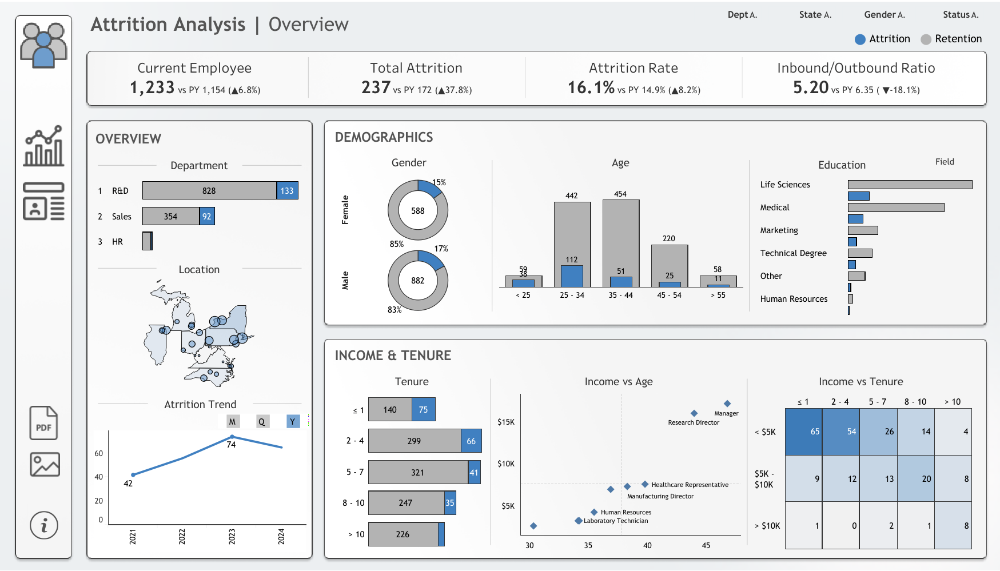

# HR Attrition Analysis Dashboard

## Project Overview

Employee attrition (turnover) is a critical challenge for organizations. Understanding why employees leave helps HR take corrective actions.  

This project answers key questions:
- Which factors are most correlated with attrition?  
- Do **income, job role, education, and age** affect attrition rates?  
- How do years at company or job satisfaction influence attrition?  
- Can dashboards provide quick insights for HR managers?  

**Live Dashboard:** [View on Tableau Public](https://public.tableau.com/views/AttritionAnalysis_17529149329710/HRSummary?:language=en-GB&:sid=&:redirect=auth&:display_count=n&:origin=viz_share_link)
## Dashboard Preview
 

## Workflow Details

### Data Source
- Dataset: [IBM HR Analytics Attrition & Performance](https://www.kaggle.com/pavansubhasht/ibm-hr-analytics-attrition-dataset)  
- Shape: ~1,400 employee records × 35 features.  
- Features include: Age, Job Role, Monthly Income, Work-Life Balance, Education, Gender, Years at Company, etc.  
- Target Variable: **Attrition** (Yes/No).

### Data Preprocessing
* **Loaded dataset** into Pandas from Excel.
* **Added geography** by randomly assigning each employee a `State` and `City` (weighted by probability).
* **Generated dates**: Created realistic `Hire Date` and `Last Working Date` based on tenure and attrition status.
* **Modeled attrition probability** using quarterly trends, tenure effects, and state-level adjustments.
* **Simulated attrition outcomes** (`Attrition_Flag`) with a binomial distribution.
* **Exported enhanced dataset** (`attrition_data.xlsx`) for Tableau visualization.

### Dashboard in Tableau
- Imported the cleaned dataset.  
- Built multiple **interactive views**:
  - **Attrition by Job Role** – Which roles see the highest turnover.  
  - **Attrition by Age Group & Gender** – Demographic breakdown.  
  - **Attrition vs Monthly Income** – Income’s role in retention.  
  - **Attrition by Years at Company** – Tenure trends.  
  - **Education & Attrition** – How qualification impacts turnover.  
  and so on.

